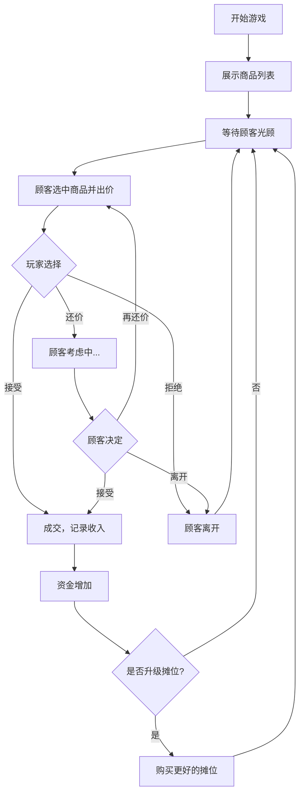

## 1. 产品概述

跳蚤市场摆摊模拟器是一款休闲经营类网页游戏，玩家扮演跳蚤市场摊主，通过定价、讨价还价出售闲置物品赚取利润，并用赚到的钱升级摊位位置以吸引更多顾客。

- 核心玩法：商品定价 + 讨价还价 + 摊位升级
- 目标用户：喜欢休闲经营、模拟类游戏的玩家
- 产品价值：提供轻松有趣的 bargaining 体验，考验玩家的商业直觉

## 2. 核心功能

### 2.1 用户角色

| 角色 | 登录方式 | 核心权限 |
|------|----------|----------|
| 玩家 | 直接进入 | 管理商品、与顾客讨价还价、升级摊位 |

### 2.2 功能模块

1. **摊位主界面**：商品列表展示、当前资金、摊位等级
2. **顾客交互系统**：随机顾客光顾、出价、多轮讨价还价
3. **交易记录系统**：成交历史、收入统计
4. **摊位升级系统**：用盈利购买更好的摊位位置

### 2.3 页面详情

| 页面名称 | 模块名称 | 功能描述 |
|----------|----------|----------|
| 主游戏页面 | 顶部状态栏 | 显示当前资金、摊位等级、今日收入 |
| 主游戏页面 | 商品陈列区 | 卡片式展示所有在售商品，包含图片、名称、标价、成本 |
| 主游戏页面 | 顾客对话区 | 顾客气泡对话、出价信息、讨价还价交互按钮 |
| 主游戏页面 | 交易记录 | 历史成交列表，显示商品、成交价、利润 |
| 主游戏页面 | 摊位升级面板 | 展示可升级的摊位位置及效果，购买升级 |

## 3. 核心流程

玩家进入游戏 → 查看商品列表和标价 → 等待随机顾客光顾 → 顾客对某件商品出价 → 玩家选择接受/拒绝/还价 → 多轮讨价还价 → 成交或顾客离开 → 记录收入 → 积累资金升级摊位 → 吸引更多顾客/提高售价

## 4. 用户界面设计

### 4.1 设计风格

- **主色调**：暖橙色调 (#F97316) 搭配米色背景，营造集市热闹氛围
- **辅助色**：暖黄色 (#FBBF24)、红褐色 (#B45309)、深棕色 (#78350F)
- **按钮风格**：圆角矩形按钮，带有微妙的阴影和悬浮效果
- **字体**：标题使用有趣的手写风格字体，正文使用圆润易读的无衬线字体
- **布局风格**：卡片式布局，模拟跳蚤市场摊位的感觉
- **图标风格**：使用 emoji 风格图标，增添趣味性

### 4.2 页面设计概述

| 页面名称 | 模块名称 | UI元素 |
|----------|----------|--------|
| 主游戏页面 | 顶部状态栏 | 金币图标+金额、摊位等级徽章、今日收入统计 |
| 主游戏页面 | 商品陈列区 | 网格布局商品卡片，每张卡片有商品图、名称、标价标签、成本价 |
| 主游戏页面 | 顾客对话区 | 卡通顾客头像、对话气泡、出价金额、三个操作按钮 |
| 主游戏页面 | 交易记录 | 可滚动的交易历史列表，按时间倒序排列 |
| 主游戏页面 | 摊位升级 | 摊位等级卡片，展示当前等级和下一等级的效果 |

### 4.3 响应式

- 采用桌面端优先设计，同时适配平板和手机屏幕
- 商品卡片在小屏幕上自动调整为单列或双列布局
- 触摸设备优化按钮尺寸和点击区域

### 4.4 动效设计

- 顾客出现时有淡入和滑入动画
- 成交时有金币飞入的动画效果
- 按钮点击有缩放反馈
- 价格变化有数字滚动动画
- 商品售出后有淡出效果
