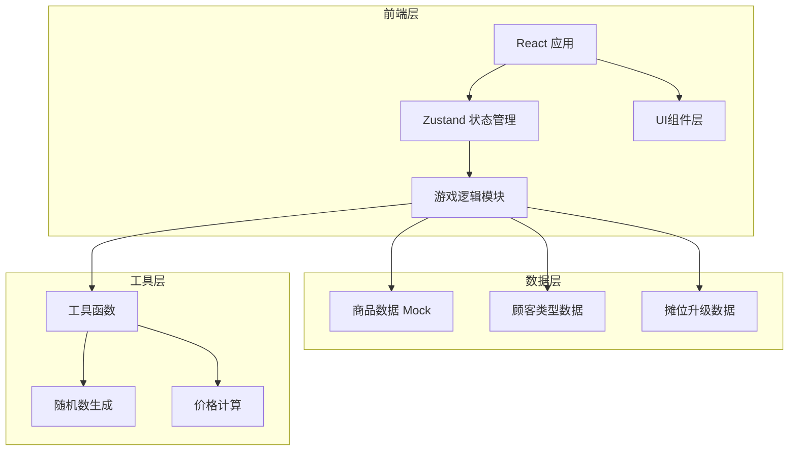
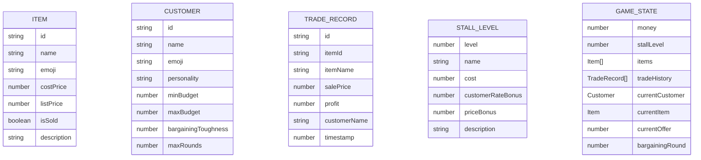

## 1. 架构设计



## 2. 技术描述

- **前端框架**: React@18 + TypeScript
- **构建工具**: Vite
- **样式方案**: TailwindCSS@3
- **状态管理**: Zustand
- **路由**: 单页面应用，无需路由
- **后端**: 无后端，纯前端游戏，数据使用 Mock
- **图标**: Lucide React

## 3. 页面/模块结构

| 模块路径 | 用途 |
|---------|------|
| src/App.tsx | 主应用入口 |
| src/store/gameStore.ts | 游戏全局状态管理 |
| src/components/Header.tsx | 顶部状态栏组件 |
| src/components/ItemCard.tsx | 商品卡片组件 |
| src/components/ItemList.tsx | 商品列表组件 |
| src/components/CustomerDialog.tsx | 顾客对话组件 |
| src/components/TradeHistory.tsx | 交易记录组件 |
| src/components/StallUpgrade.tsx | 摊位升级组件 |
| src/data/items.ts | 商品数据 |
| src/data/customers.ts | 顾客类型数据 |
| src/data/stalls.ts | 摊位升级数据 |
| src/utils/gameLogic.ts | 游戏逻辑工具函数 |
| src/utils/format.ts | 格式化工具函数 |

## 4. 数据模型

### 4.1 数据模型定义



### 4.2 核心类型定义

```typescript
// 商品
interface Item {
  id: string;
  name: string;
  emoji: string;
  costPrice: number;
  listPrice: number;
  isSold: boolean;
  description: string;
}

// 顾客
interface Customer {
  id: string;
  name: string;
  emoji: string;
  personality: 'friendly' | 'tough' | 'hurried' | 'picky';
  minBudget: number;
  maxBudget: number;
  bargainingToughness: number; // 0-1, 越高越难砍价
  maxRounds: number;
}

// 交易记录
interface TradeRecord {
  id: string;
  itemId: string;
  itemName: string;
  salePrice: number;
  profit: number;
  customerName: string;
  timestamp: number;
}

// 摊位等级
interface StallLevel {
  level: number;
  name: string;
  cost: number;
  customerRateBonus: number;
  priceBonus: number;
  description: string;
}

// 游戏状态
interface GameState {
  money: number;
  stallLevel: number;
  items: Item[];
  tradeHistory: TradeRecord[];
  currentCustomer: Customer | null;
  currentItem: Item | null;
  currentOffer: number;
  bargainingRound: number;
  isNegotiating: boolean;
}
```

## 5. 核心游戏逻辑

### 5.1 顾客生成逻辑
- 根据摊位等级影响顾客出现频率
- 随机选择顾客类型（友好型/强硬型/匆忙型/挑剔型）
- 随机选择一件在售商品

### 5.2 出价逻辑
- 顾客初始出价在其预算范围内
- 受商品标价影响，围绕标价波动
- 不同性格的顾客出价策略不同

### 5.3 讨价还价逻辑
- 玩家还价后，顾客根据性格决定是否接受
- 每轮讨价还价，顾客会调整出价
- 达到最大回合数或价格差距过大时顾客离开

### 5.4 摊位升级逻辑
- 升级需要一定金额
- 升级后提高顾客光顾频率
- 升级后顾客初始出价更接近标价
